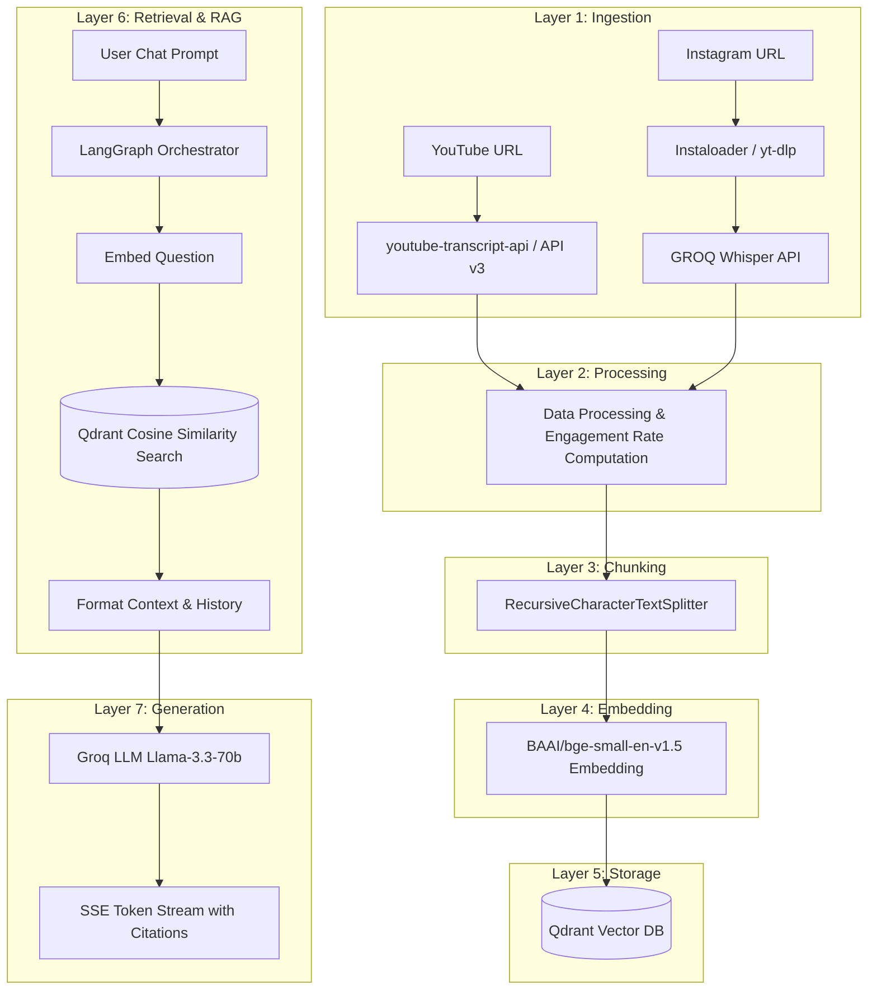
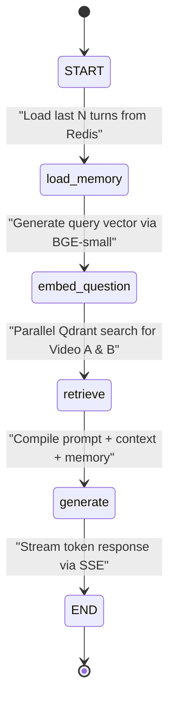

# VideoRAG: High-Performance Video & Reel Retrieval-Augmented Generation

VideoRAG is a production-grade, full-stack Retrieval-Augmented Generation (RAG) platform that allows users to ingest, analyze, and interactively query YouTube videos and Instagram Reels side by side. By combining asynchronous metadata ingestion, audio transcription, vector embeddings, and an agentic conversation flow, VideoRAG delivers low-latency, contextual insights comparing performance metrics, hooks, and transcripts across platforms.

---

## Key Features

- **Asynchronous Ingestion Pipeline**: YouTube transcript & official data API v3 fetch, and Instagram Reels scraper/download (Instaloader with `yt-dlp` fallback) + GROQ Whisper API transcription.
- **Concurrently Parallelized Stages**: Ingestion, chunking, embedding, and vector database upsert stages run concurrently using `asyncio` and `ThreadPoolExecutor` to minimize processing latency.
- **Agentic Orchestration with LangGraph**: A stateful graph orchestration engine managing sliding memory windows, query vectorization, parallel vector DB retrieval, and Groq-powered generation.
- **Optimized Vector Storage**: Leverages a local Qdrant Vector DB instance for fast cosine similarity search with metadata payload filtering by `video_id`.
- **Stateful Persistence**: Uses Redis with LangGraph's `AsyncRedisSaver` to persist conversation history and process job states across server restarts.
- **SSE Streaming with Inline Citations**: Server-Sent Events (SSE) streaming answers in real-time, parsing and rendering inline citations (e.g., `[Video A, chunk 3]`) as visual badges.
- **Next.js & Tailwind UI**: A polished, responsive 3-column dashboard featuring side-by-side video metric comparison cards, progress tracking, and an interactive streaming chat interface.

---

## System Architecture

### 1. 7-Layer Data Flow
The architecture is designed around a 7-layer pipeline where each component has a single responsibility, exchanging strictly defined JSON data structures.



### 2. LangGraph Conversation Workflow
Each user prompt triggers a stateful graph lifecycle, utilizing a shared `RAGState` TypedDict to maintain memory and context.



### 3. Parallelization Map
To achieve minimum end-to-end ingestion and response latency, heavy I/O operations are run concurrently:

| Parallel Group | Concurrent Operations | Latency Savings |
| :--- | :--- | :--- |
| **Ingestion** | YouTube fetch & Instagram fetch run concurrently via `asyncio.gather()` | ~2.0s |
| **YouTube Fetch** | YouTube transcript fetching & YouTube Data API v3 metadata lookup run concurrently | ~0.3s |
| **Chunking** | Chunking transcript texts for Video A & Video B in parallel threads | ~0.1s |
| **Embedding** | Generating vector embeddings for Video A & B chunks in a `ThreadPoolExecutor` | ~1.0s |
| **Retrieval** | Qdrant vector search queries for Video A & Video B execute concurrently | ~10ms / chat turn |

---

## Engineering Reasoning & Cost-Efficiency at Scale

### Cost Analysis (1,000 Creators / Day)
Designed for low cost, the architecture relies on local embeddings, self-hosted data stores, and free/low-cost API tiers.

| Operation | Technology Choice | Cost Per Creator (2 videos) | Total Cost / 1,000 Creators |
| :--- | :--- | :--- | :--- |
| **YouTube Transcript** | `youtube-transcript-api` | $0.00 | $0.00 |
| **YouTube Metadata** | YouTube Data API v3 (Free Quota) | $0.00 | $0.00 |
| **Instagram Transcript** | GROQ Whisper API (1-minute reel) | $0.006 | $6.00 |
| **Embeddings** | Local `BAAI/bge-small-en-v1.5` (CPU) | $0.00 | $0.00 |
| **Vector DB** | Local Qdrant (Dockerized) | $0.00 | $0.00 |
| **LLM Inference** | Groq Paid Tier (`$0.59/M` input) | ~$0.001 | ~$1.00 |
| **Session Cache & Memory** | Redis (Dockerized) | $0.00 | $0.00 |
| **Total Daily Cost** | | **~$0.007 / user** | **~$7.00 / day** |

### Latency Optimization
- **First Token Latency (TTFT)**: ~200ms-400ms using Groq's high-speed Llama-3.3-70b-versatile.
- **WebSocket Auto-Unlock**: Since Instagram reels require audio download and transcription, Video A (YouTube) metadata and transcript render instantly (~1.5s). Video B (Instagram) auto-unlocks and populates its metrics in the frontend dynamically upon completion via WebSocket push.

---

## Production Scaling Plan (10,000+ Concurrent Users)

To scale the single-instance setup to 10k+ concurrent users, the following production topology is used:

1. **Process & Concurrency Level**:
   Deploy FastAPI using Gunicorn with 8 Uvicorn worker processes to handle high SSE streaming loads:
   ```bash
   gunicorn main:app -k uvicorn.workers.UvicornWorker -w 8 --bind 0.0.0.0:8000 --timeout 300
   ```
2. **Database Clustering**:
   - **Qdrant**: Deploy as a 3-node High Availability (HA) cluster to distribute search workloads.
   - **Redis**: Deploy a Redis Sentinel configuration to manage automatic failover and scale pub/sub message delivery.
3. **Nginx Load Balancer**:
   Add an Nginx layer upstream to distribute traffic using `least_conn` and disable proxy buffering to prevent SSE stream delays:
   ```nginx
   upstream videorag_backend {
       least_conn;
       server 127.0.0.1:8000;
       server 127.0.0.1:8001;
   }
   server {
       location /chat {
           proxy_pass http://videorag_backend;
           proxy_buffering off;
           proxy_read_timeout 300s;
       }
   }
   ```
4. **Redis Multi-Level Caching**:
   - **URL transcripts & embeddings**: Cached for 7 days (keyed by `sha256(url)`).
   - **Qdrant Search Contexts**: Cached for 5 minutes (keyed by `sha256(question + video_ids)`).
   - **YouTube API Metadata**: Cached for 1 hour to prevent API quota exhaust.

---

## Directory Structure

### Backend
```
backend/
├── main.py             # FastAPI entrypoint, CORS & route mounting
├── config.py           # Configuration management and API key loading
├── models.py           # Pydantic schemas for chat requests & metadata payloads
├── state.py            # Redis job state manager & websocket channel handler
├── routes/
│   ├── ingest.py       # Asynchronous ingestion orchestrator
│   ├── status.py       # Job status polling route
│   ├── chat.py         # LangGraph SSE streaming endpoint
│   └── ws.py           # WebSocket endpoint pushing real-time ingest events
├── services/
│   ├── ingestion.py    # Raw metadata scraping & Whisper transcription
│   ├── chunker.py      # RecursiveCharacterTextSplitter logic
│   ├── embedder.py     # Local SentenceTransformer embeddings wrapper
│   ├── vector_store.py # Qdrant collection administration & point upsertion
│   └── llm.py          # Stateful LangGraph initialization & node definition
└── tests/              # Automated script pipeline validation suite
```

### Frontend
```
frontend/
├── app/
│   ├── layout.tsx      # Next.js global context & font loaders
│   ├── page.tsx        # Dashboard layout grid
│   └── globals.css     # Global Tailwind styles
├── components/
│   ├── VideoCard.tsx   # Side-by-side media comparison panel
│   ├── ChatPanel.tsx   # Interactive chat interface & suggested questions
│   ├── MessageBubble.tsx # Chat dialog container parsing inline citations
│   └── ProgressBar.tsx # Stage-based ingestion tracker
└── hooks/
    ├── useIngest.ts    # POST /ingest and polling triggers
    ├── useChat.ts      # React SSE consumer hook
    └── useWebSocket.ts # Live ingestion updates hook
```

---

## Backend Setup & Run

### 1. Prerequisites
- Python 3.11+
- Docker & Docker Compose
- API Keys: YouTube Data API v3 Key, OpenAI API Key (Whisper), Groq API Key

### 2. Installation
1. Navigate to the backend folder:
   ```bash
   cd backend
   ```
2. Create and activate a Python virtual environment:
   ```bash
   python -m venv .venv
   # Windows:
   .venv\Scripts\activate
   # Linux/macOS:
   source .venv/bin/activate
   ```
3. Install the dependencies:
   ```bash
   pip install -r requirements.txt
   ```
4. Configure environmental variables. Create a `.env` file containing:
   ```env
   YOUTUBE_API_KEY=your_youtube_api_key
   OPENAI_API_KEY=your_openai_api_key
   GROQ_API_KEY=your_groq_api_key
   REDIS_URL=redis://localhost:6379
   QDRANT_HOST=localhost
   QDRANT_PORT=6333
   ```
5. Spin up Docker containers for Qdrant and Redis:
   ```bash
   docker compose up -d qdrant redis
   ```
6. Start the FastAPI development server:
   ```bash
   uvicorn main:app --reload --port 8000
   ```
   Interactive API documentation will be available at `http://localhost:8000/docs`.

---

## Frontend Setup & Run

### 1. Installation
1. Navigate to the frontend directory:
   ```bash
   cd frontend
   ```
2. Install the frontend dependencies:
   ```bash
   npm install
   ```
3. Create a `.env.local` configuration file:
   ```env
   NEXT_PUBLIC_API_URL=http://localhost:8000
   NEXT_PUBLIC_WS_URL=ws://localhost:8000
   ```
4. Run the development server:
   ```bash
   npm run dev
   ```
   The user interface will be served at `http://localhost:3000`.

---

## Automated Validation & Testing

To run the validation test suite:
1. Ensure your backend virtual environment is active.
2. Run any of the test scripts from the `backend/tests/` folder:
   ```bash
   # Run chunks validation
   python tests/test_chunks.py
   
   # Run YouTube pipeline validation
   python tests/test_youtube.py
   
   # Run Instagram pipeline validation
   python tests/test_instagram.py
   
   # Run full end-to-end local evaluation
   python tests/test_e2e.py
   ```